# 🏦 UCI Bank Marketing — Customer Segmentation & Subscription Prediction


> **Predict which bank customers will subscribe to a term deposit — and segment them into actionable marketing clusters — using a full end-to-end ML pipeline deployed in an interactive Streamlit dashboard.**
>
> 
[See The Deployed Project Here!](https://msba-capstone-project.streamlit.app/)
---

## 📋 Table of Contents

1. [Project Overview](#-project-overview)
2. [Data Description](#-data-description)
3. [End-to-End Analysis & Modeling Process](#-end-to-end-analysis--modeling-process)
   - [Step 1 — Business Understanding & Data Acquisition](#step-1--business-understanding--data-acquisition)
   - [Step 2 — Data Cleaning & Feature Engineering](#step-2--data-cleaning--feature-engineering)
   - [Step 3 — Exploratory Data Analysis (EDA)](#step-3--exploratory-data-analysis-eda)
   - [Step 4 — Preprocessing & Clustering Pipeline](#step-4--preprocessing--clustering-pipeline)
   - [Step 5 — Cluster Analysis & Interpretation](#step-5--cluster-analysis--interpretation)
   - [Step 6 — Classification Modeling](#step-6--classification-modeling)
   - [Step 7 — Model Evaluation & Selection](#step-7--model-evaluation--selection)
   - [Step 8 — Streamlit Application](#step-8--streamlit-application)
4. [Pipeline Architecture](#-pipeline-architecture)
5. [Key Insights & Results](#-key-insights--results)
6. [Project Structure](#-project-structure)
7. [How to Run the Project](#-how-to-run-the-project)

---

## 🎯 Project Overview

Portuguese banks run telemarketing campaigns to sell term deposit subscriptions — a critical revenue product with a natural but challenging conversion rate of roughly **11%**. This project builds a production-ready ML system to answer two strategic questions:

1. **Who is most likely to subscribe?** — A tuned XGBoost binary classifier predicts individual subscription probability so campaign resources can be concentrated on high-yield prospects.
2. **What kinds of customers exist?** — Agglomerative clustering segments the customer base into three behaviorally distinct groups, each with different conversion rates, call-duration profiles, and macroeconomic sensitivity.

The result is a **six-page Streamlit dashboard** that combines interactive EDA, cluster profiling, and real-time model scoring — suitable for both analysts and campaign managers.

**Target audience:** Marketing strategists, CRM teams, campaign planners, and data science hiring managers reviewing portfolio work.

---

## 📊 Data Description

| Attribute | Details |
|-----------|---------|
| **Source** | UCI Machine Learning Repository — Portuguese banking institution |
| **Citation** | Moro, Cortez & Rita (2014), *Decision Support Systems* |
| **Period** | May 2008 – November 2010 |
| **Raw records** | 41,188 rows × 21 columns |
| **Records after cleaning** | 39,803 rows × 22 columns |
| **Target** | `term_deposit_subscribed` — binary (yes / no) |
| **Class balance** | 88.7% negative (no) / 11.3% positive (yes) |

**Feature categories in the raw data:**

- **Client demographics** — age, job, marital status, education level, credit default status, housing loan, personal loan
- **Campaign contact** — communication type, last contact month, number of contacts in this campaign, days since last contact, number of previous contacts, previous campaign outcome
- **Macroeconomic context** — employment variation rate, consumer price index, consumer confidence index, Euribor 3-month rate, number of bank employees

---

## 🔬 End-to-End Analysis & Modeling Process

### Step 1 — Business Understanding & Data Acquisition

The dataset captures a real bank's outbound calling campaign. The core business problem is **resource allocation**: calling every customer is expensive and drives churn. The project therefore frames the problem as imbalanced binary classification and uses PR-AUC as the primary evaluation metric (superior to accuracy or ROC-AUC when the positive class is rare).

The full dataset (`bank-additional-full.csv`) was loaded directly — 41,188 records with no prior filtering — to preserve maximum signal before any analytical decisions were made.

---

### Step 2 — Data Cleaning & Feature Engineering

**Notebook:** `1_UCI_Data_Cleaning.ipynb`

#### Column Renaming
All 21 original column names were replaced with descriptive, snake-case equivalents (e.g., `y` → `term_deposit_subscribed`, `emp.var.rate` → `employment_variation_rate`) to improve readability across all downstream notebooks and the app.

#### Missing / Unknown Values

| Column | Strategy | Rows Affected |
|--------|----------|---------------|
| `job` — 'unknown' | Dropped | 330 rows (0.8%) |
| `marital_status` — 'unknown' | Dropped | 80 rows (0.2%) |
| `has_housing_loan` & `has_personal_loan` — 'unknown' | Dropped (overlapping) | ~984 rows (2.4%) |
| `education_level` — 'unknown' | Mode-imputed within each job group | Retained |
| `default_status` — 'unknown' | Kept as explicit category | 20.9% of data |
| `days_since_prev_campaign_contact` — value 999 | Replaced with NaN | — |

#### Feature Engineering

Three binary indicator columns were created before any sparsity-driven drops:

- `was_previously_contacted` — 1 if the customer had been called in a prior campaign (3.7% positive)
- `positive_campaign_result` — 1 if the prior campaign resulted in a subscription (13.6% positive)
- `default_status_known` — 1 if default status is explicitly known (vs. "unknown")

#### Columns Dropped

| Column | Reason |
|--------|--------|
| `days_since_prev_campaign_contact` | 96.3% are value 999 (never contacted) — information already captured by `was_previously_contacted` |
| `previous_campaign_result` | 86.4% "nonexistent" — redundant with `positive_campaign_result` flag |
| `employment_variation_rate` | Highly multicollinear with Euribor and other macro indicators |
| `num_employees` | Highly multicollinear with `employment_variation_rate` |
| `consumer_price_index` | Highly multicollinear with other macro indicators |

**Net result:** 39,803 records × 22 columns saved to `data_cleaned_for_clustering.csv`.

---

### Step 3 — Exploratory Data Analysis (EDA)

**Notebook:** `2_EDA.ipynb` | **App page:** `2_General_Analysis.py`

EDA was structured in four phases: univariate analysis, bivariate/target relationships, multivariate segment exploration, and preparation for clustering.

#### Overall Subscription Rate

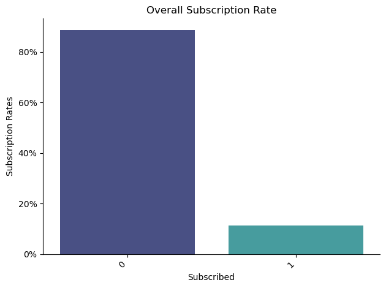

#### Age Distribution

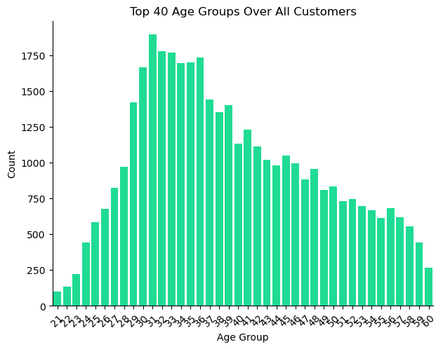

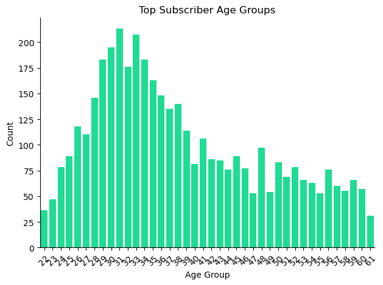

#### Job & Education

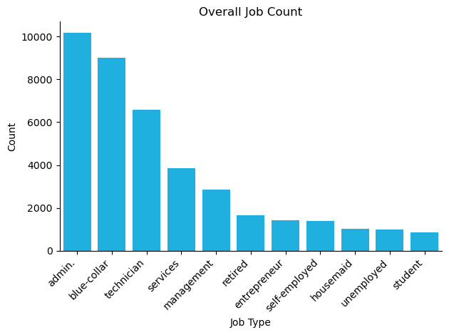

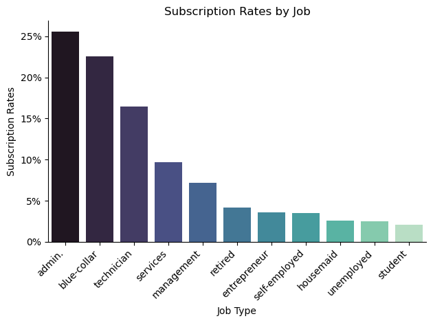

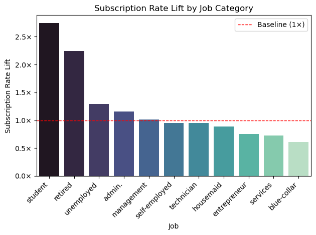

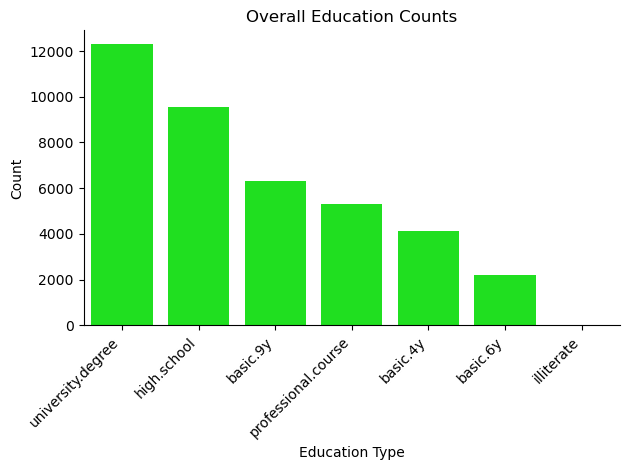

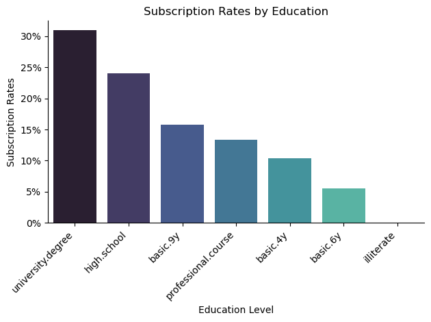

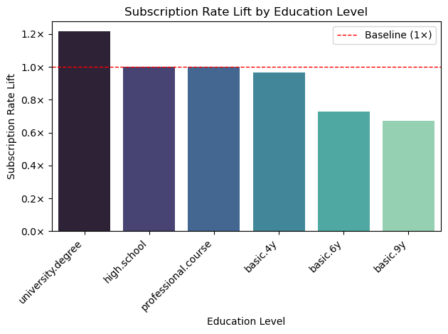

#### Marital Status

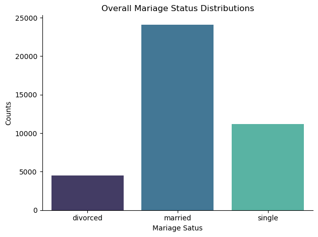

#### Contact Timing & Campaign Behavior

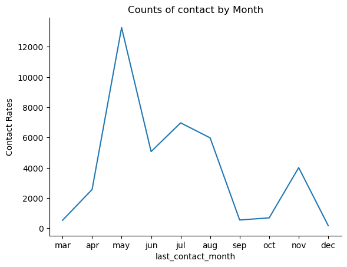

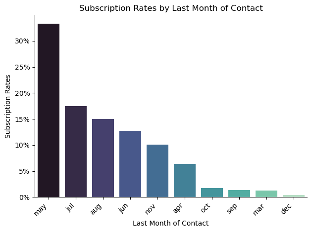

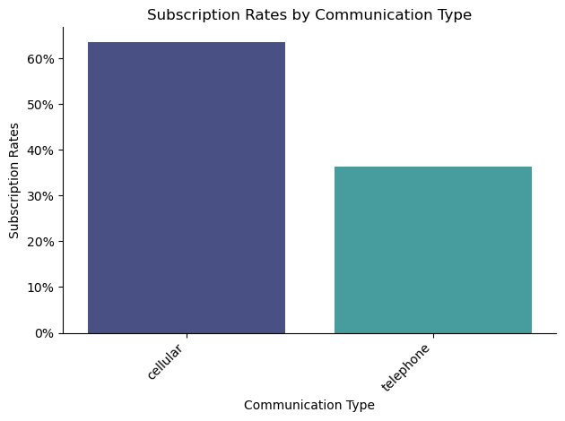

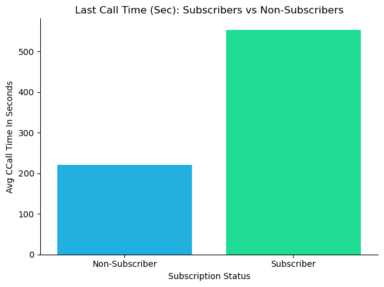

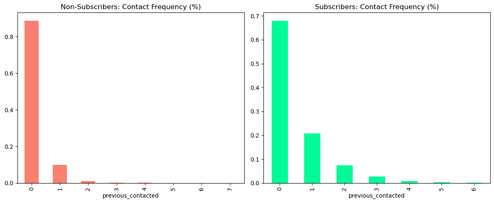

#### Macroeconomic Context

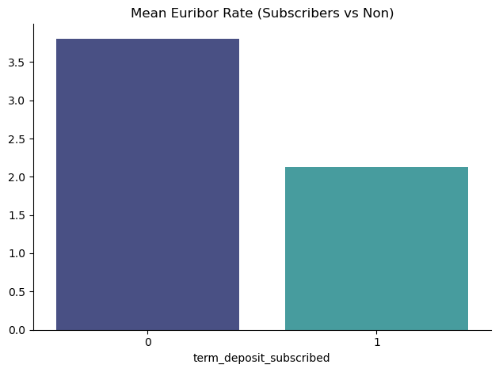

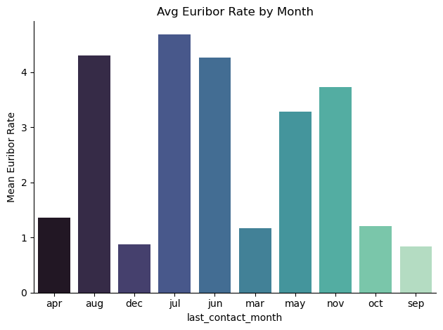

#### Correlations

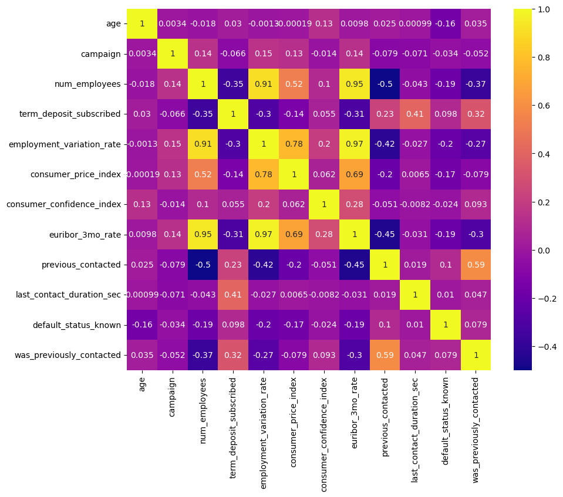

#### Cross-Feature Interactions

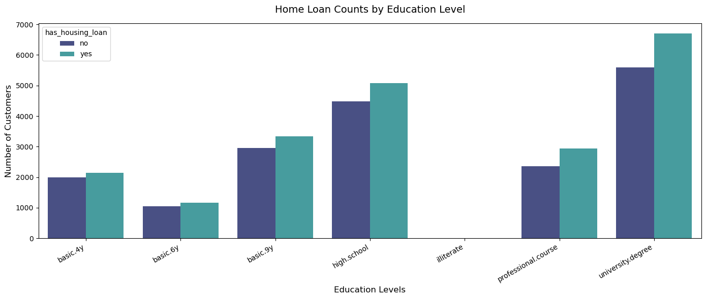

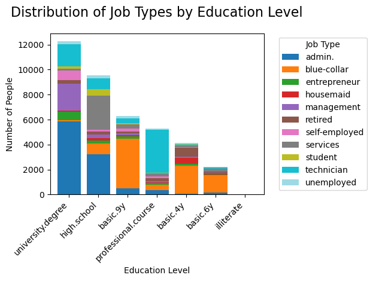

---

### Step 4 — Preprocessing & Clustering Pipeline

**Notebook:** `3_Preprocessing_Clustering.ipynb`

#### Preprocessing Pipeline

A `ColumnTransformer` pipeline was built for consistent transformation across clustering and classification:

```python
numeric_transformer  = StandardScaler()
categorical_transformer = OneHotEncoder(handle_unknown='ignore', sparse_output=False)

preprocessor = ColumnTransformer([
    ('num', numeric_transformer, numeric_cols),
    ('cat', categorical_transformer, categorical_cols)
])
```

**Numeric features (9):** `age`, `campaign`, `term_deposit_subscribed`, `consumer_confidence_index`, `euribor_3mo_rate`, `previous_contacted`, `last_contact_duration_sec`, `was_previously_contacted`, `positive_campaign_result`

**Categorical features (8):** `job`, `has_housing_loan`, `has_personal_loan`, `default_status`, `marital_status`, `education_level`, `communication_type`, `last_contact_month`

#### Dimensionality Reduction

PCA with **10 components** was applied to the scaled/encoded feature matrix before clustering. This step reduces the dimensionality introduced by one-hot encoding (which expands categorical columns into ~40+ binary columns) and removes noise that would distort distance-based clustering.

#### Clustering Algorithm Selection

Both K-Means and Agglomerative Clustering were evaluated:

| Algorithm | k | Linkage | Silhouette Score |
|-----------|---|---------|-----------------|
| K-Means | 4 | — | 0.1932 |
| Agglomerative | 2 | Average | 0.7176 |
| Agglomerative | 3 | Average | 0.5316 |
| **Agglomerative** | **3** | **Ward** | **0.2589** ✅ |

**Why Ward linkage with k=3?** Average linkage with k=2 produced the highest silhouette score but collapsed the customer base into two overly broad groups with limited business utility. Ward linkage with k=3 struck the right balance between cluster separation (silhouette > K-Means) and **business granularity** — three segments map naturally to marketing personas and allow differentiated campaign strategies.

**Saved artifacts:**
- `Models/preprocessing_pipeline.pkl` — StandardScaler + OneHotEncoder pipeline
- `Models/pca.pkl` — PCA transformer (10 components)
- `Models/agglomerative_model.pkl` — Final clustering model
- `Models/numeric_cols.pkl` / `Models/categorical_cols.pkl` — Feature lists

---

### Step 5 — Cluster Analysis & Interpretation

**Notebook:** `4_Clustering_Analysis.ipynb` | **App page:** `3_Segmentation_Anlaysis.py`

#### Cluster Profiles — Numeric Means

| Metric | Cluster 0 | Cluster 1 | Cluster 2 |
|--------|:---------:|:---------:|:---------:|
| **Size** | 5,433 (13.65%) | 8,320 (20.90%) | 26,050 (65.45%) |
| Age | 40.4 | 38.9 | 40.2 |
| Campaign contacts | 1.96 | 2.27 | 2.79 |
| **Subscription rate** | **26.43%** | **36.67%** | **0.00%** |
| Consumer Confidence Index | −41.68 | −44.22 | −39.10 |
| **Euribor 3M Rate** | **1.50** | **1.83** | **4.63** |
| Last Contact Duration (sec) | 265.6 | 376.3 | 219.5 |
| Previously Contacted | 1.26 | 0.00 | 0.00 |
| Positive Campaign Result | 1.00 | 0.00 | 0.00 |

#### Cluster 0 — "Repeat Responders" (13.65%)

Customers who were **previously contacted and succeeded in prior campaigns**. All records in this cluster carry `positive_campaign_result = 1`, explaining the elevated 26.4% subscription rate. Euribor rates are low (1.50), placing these interactions in a favorable interest rate environment. Call duration is moderate (median ~198 sec).

**Marketing strategy:** These are warm leads — previously engaged, proven responsive. Prioritize for retention outreach and cross-sell campaigns. Minimal persuasion budget needed.

#### Cluster 1 — "Engaged Long-Callers" (20.90%) ⭐ Highest Value

The **highest-converting segment** at 36.67%. These customers were never previously contacted (`positive_campaign_result = 0`, `was_previously_contacted = 0`) but responded to longer, more engaged conversations (mean call duration 376 sec — the longest of all clusters). Euribor rates are low (1.83), similar to Cluster 0.

**Marketing strategy:** Invest in call quality over call volume. A single well-executed conversation is highly effective. Screen for cellular contact method (85.8% of this cluster uses cellular) and low-Euribor periods.

#### Cluster 2 — "Cold Prospects" (65.45%)

The largest segment with a **zero subscription rate**. These customers were never previously contacted and experienced significantly higher Euribor rates (4.63) — suggesting their contacts fell during an economically unfavorable period for term deposits. Call duration is shortest (median ~162 sec).

**Marketing strategy:** Deprioritize during high-Euribor periods. If contacted, frame messaging around rate comparisons or fixed-income security. Consider re-activating this segment when rates fall.

#### Cluster Visualizations

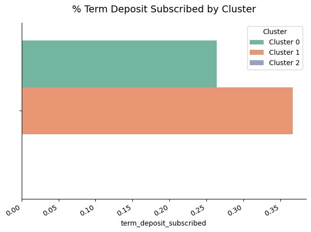

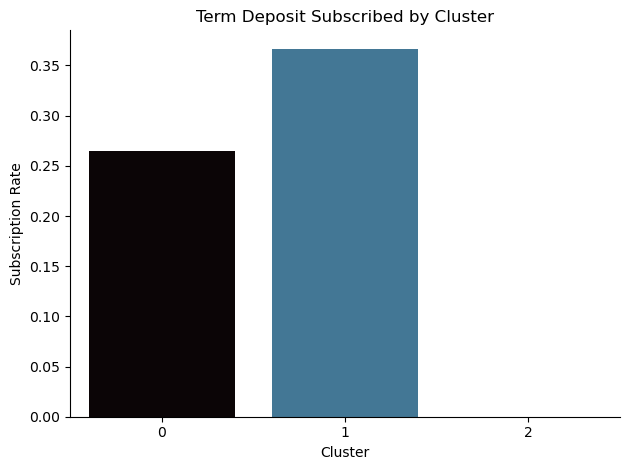

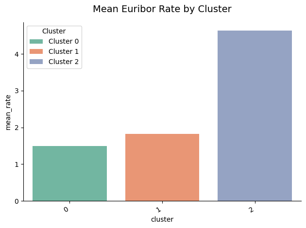

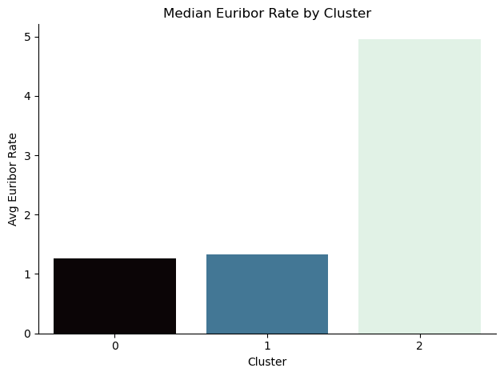

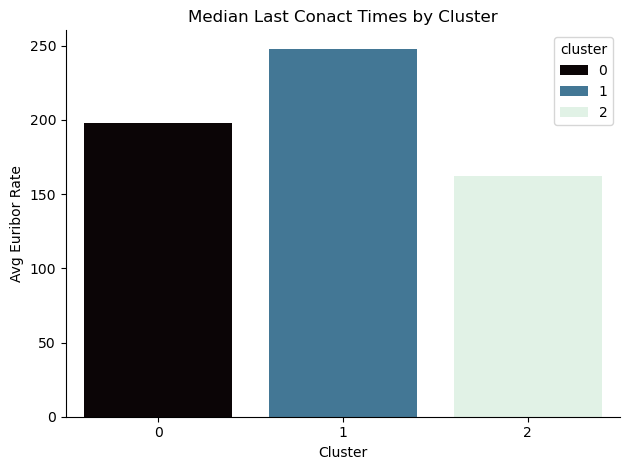

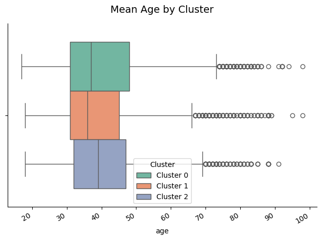

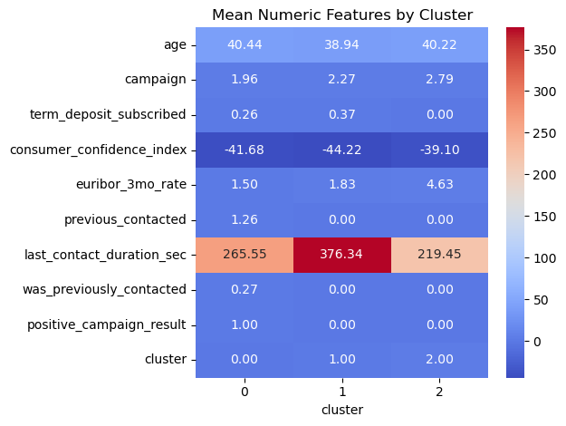

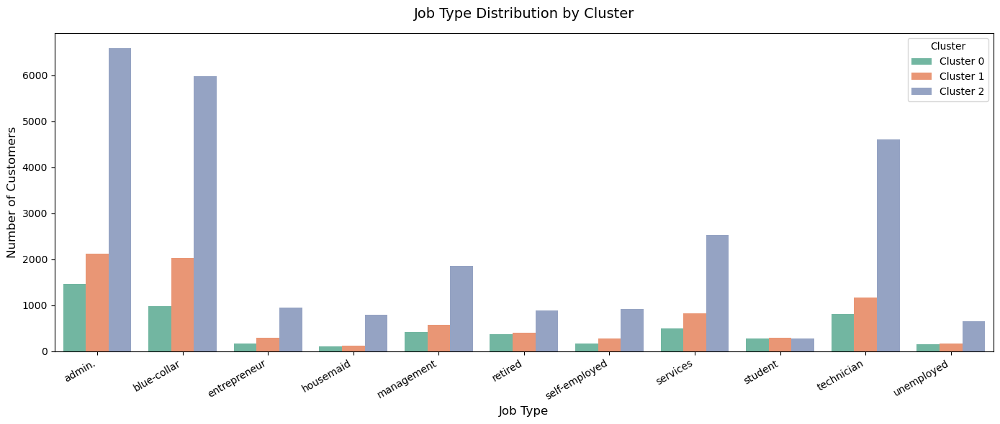

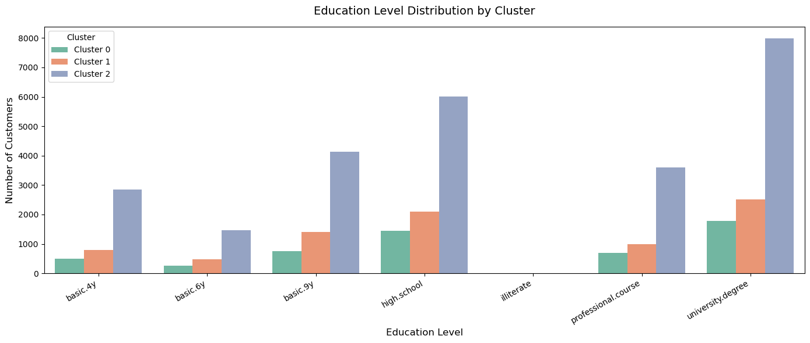

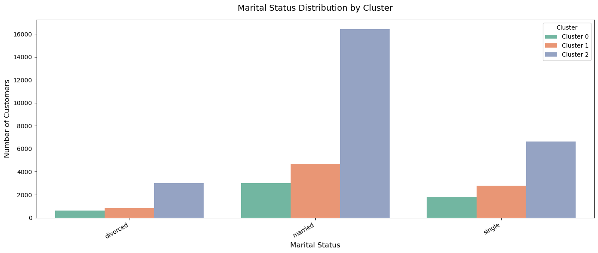

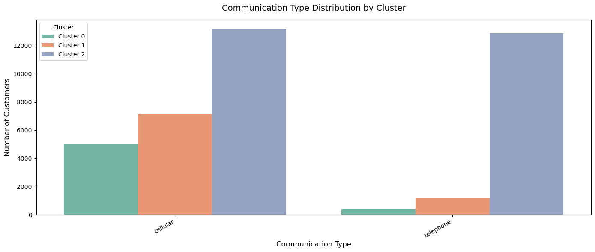

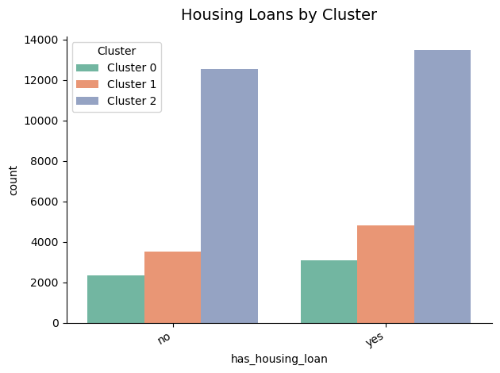

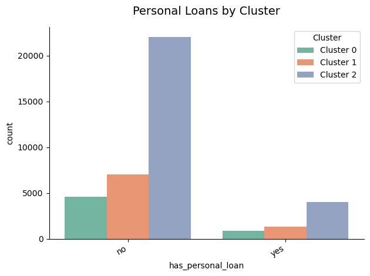

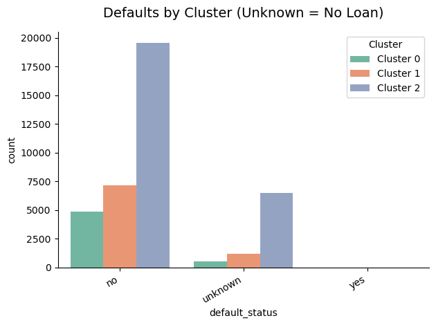

---

### Step 6 — Classification Modeling

**Notebook:** `5_Classification.ipynb`

#### Data Preparation

The `clustered_data.csv` file (39,803 rows, including cluster assignments) was used as input.

- **Target:** `term_deposit_subscribed` (binary)
- **Train/test split:** 80% train / 20% test with **stratified sampling** to preserve the 11.3% positive class ratio
  - Train set: 31,842 rows
  - Test set: 7,961 rows
- `last_contact_duration_sec` was **excluded** from the classification feature set — while it is a strong predictor, it is only observable *after* a call has taken place and would constitute data leakage in a pre-call scoring system.

**Final feature set (16 features):**

| Type | Features |
|------|----------|
| Numeric (8) | `age`, `campaign`, `consumer_confidence_index`, `euribor_3mo_rate`, `previous_contacted`, `was_previously_contacted`, `positive_campaign_result`, `cluster` |
| Categorical (8) | `job`, `has_housing_loan`, `has_personal_loan`, `default_status`, `marital_status`, `education_level`, `communication_type`, `last_contact_month` |

#### Models Evaluated

Three classifiers were built and compared using identical preprocessing pipelines:

| Model | Notes |
|-------|-------|
| **Random Forest** | `n_estimators=300`, `class_weight='balanced'`, then tuned via RandomizedSearchCV |
| **SVM (RBF kernel)** | `C=1.0`, `class_weight='balanced'`, `probability=True` — evaluated as baseline |
| **XGBoost** | `n_estimators=400`, `scale_pos_weight` set to imbalance ratio, then tuned — **selected as final model** |

#### Imbalance Handling

Rather than oversampling (SMOTE) or undersampling, **class weighting** was used throughout:
- Random Forest: `class_weight='balanced'` and `'balanced_subsample'` variants
- XGBoost: `scale_pos_weight` = ratio of negative to positive samples (~7.8)

This approach preserves all training data while penalizing misclassification of the minority class more heavily.

#### Hyperparameter Tuning

Both Random Forest and XGBoost were tuned using **RandomizedSearchCV** (40 iterations, 5-fold stratified cross-validation, optimizing `average_precision`):

**Tuned XGBoost — Best Hyperparameters:**

```python
{
    'n_estimators':      500,
    'max_depth':         4,
    'learning_rate':     0.05,
    'subsample':         0.85,
    'colsample_bytree':  0.7,
    'min_child_weight':  3,
    'gamma':             0.2,
    'scale_pos_weight':  1
}
```

**Tuned Random Forest — Best Hyperparameters:**

```python
{
    'n_estimators':      600,
    'max_depth':         25,
    'min_samples_leaf':  1,
    'min_samples_split': 2,
    'max_features':      'sqrt',
    'class_weight':      'balanced_subsample'
}
```

---

### Step 7 — Model Evaluation & Selection

**Primary metric:** PR-AUC (Average Precision) — chosen because it is directly sensitive to the minority class and does not inflate in imbalanced settings the way ROC-AUC can.

| Model | CV PR-AUC |
|-------|-----------|
| Baseline SVM | — |
| Tuned Random Forest | 0.8277 |
| **Tuned XGBoost** | **0.8522** ✅ |

**XGBoost was selected** based on highest cross-validated PR-AUC, faster inference speed, and built-in support for imbalanced learning via `scale_pos_weight`. The final pipeline (preprocessing + classifier) was saved as `Models/tuned_xgboost_model.pkl`.

#### Confusion Matrices

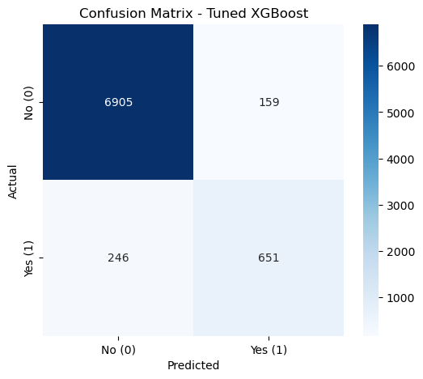

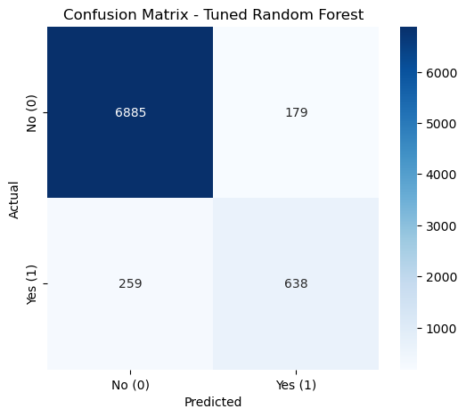

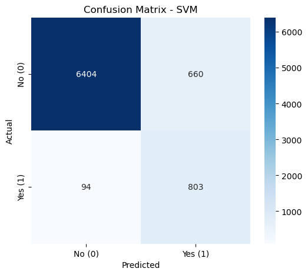

#### ROC & Precision-Recall Curves

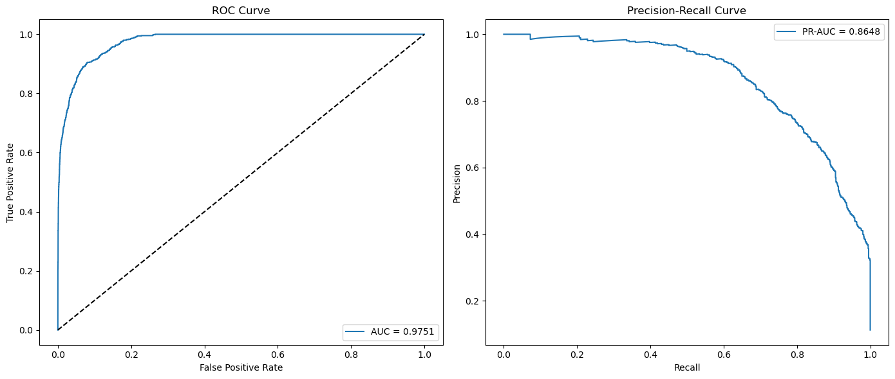

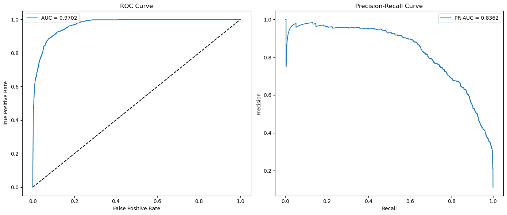

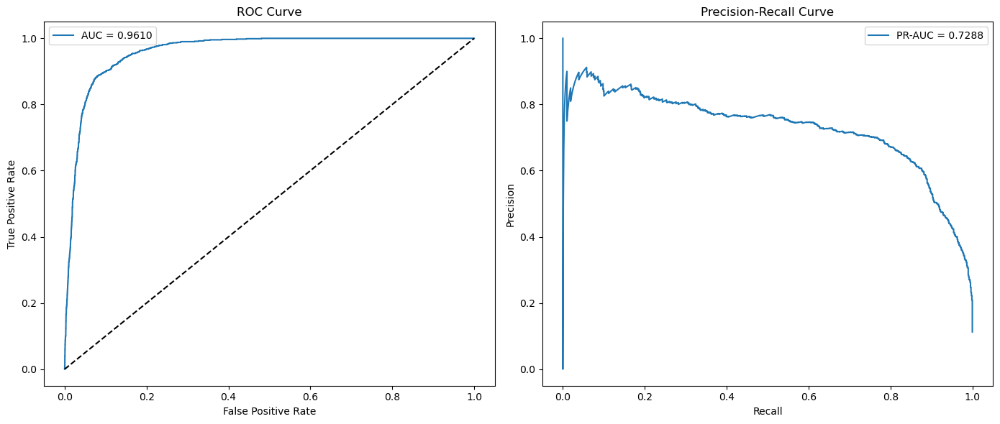

---

### Step 8 — Streamlit Application

**Directory:** `Streamlit_App/` | **Entry point:** `app.py`

The dashboard is a multi-page Streamlit application configured for wide layout with an expanded sidebar. Navigation is handled via `st.Page` objects with custom sidebar links — the automatic page navigator is hidden to allow manual routing control.

#### Pages

| Page | File | Purpose |
|------|------|---------|
| 🏠 Home | `1_Home.py` | Project overview and navigation guide |
| 📊 General Analysis | `2_General_Analysis.py` | EDA visualizations — distributions, subscription rates, correlations |
| 🔵 Segmentation Analysis | `3_Segmentation_Anlaysis.py` | Cluster profiles, conversion rates, feature breakdowns by segment |
| 🤖 Model Prediction | `4_Model_Prediction.py` | Interactive single-customer scoring with real-time probability output |
| 📋 Model Assumptions | `5_Model_Assumptions.py` | Model documentation, metrics, tuning rationale, limitations |
| 📁 About the Data | `6_About_the_data.py` | Dataset description, feature definitions, citation information |

#### Model Prediction Page — Input Features

The prediction page collects 16 inputs and passes them through the saved XGBoost pipeline:

**Numeric sliders:**
- `age` (18–80)
- `campaign` — number of contacts in this campaign (0–45)
- `consumer_confidence_index` (continuous, ≥ −60)
- `euribor_3mo_rate` (continuous, ≥ 0.0)
- `previous_contacted` — count of prior contacts (0–8)

**Dropdown selectors:**
- `job` — 11 categories (admin., technician, management, etc.)
- `has_housing_loan` — yes / no
- `has_personal_loan` — yes / no
- `default_status` — no / unknown / yes
- `marital_status` — married / single / divorced
- `education_level` — 7 levels (basic.4y through university.degree)
- `communication_type` — telephone / cellular
- `last_contact_month` — 10 months (mar through dec)
- `was_previously_contacted` — 0 / 1
- `positive_campaign_result` — 0 / 1
- `cluster` — 0 / 1 / 2

**Output:** Binary prediction (subscribe / no subscribe) + confidence probability displayed with color-coded feedback (green checkmark for positive, red X for negative).

The app loads `tuned_xgboost_model.pkl` directly — the saved pipeline internally applies StandardScaler and OneHotEncoder, so raw user inputs require no manual transformation before inference.

---

## 🏗️ Pipeline Architecture

```
Raw Input (bank-additional-full.csv, 41,188 rows)
        │
        ▼
┌─────────────────────────────────┐
│   1_UCI_Data_Cleaning.ipynb     │
│   - Column renaming             │
│   - Unknown value handling      │
│   - Feature engineering         │  ──► data_cleaned_for_clustering.csv
│   - Multicollinear drops        │       (39,803 rows × 22 cols)
└─────────────────────────────────┘
        │
        ▼
┌─────────────────────────────────┐
│  3_Preprocessing_Clustering.ipynb│
│                                 │
│  ColumnTransformer              │
│  ├── StandardScaler (numeric)   │
│  └── OneHotEncoder (categorical)│
│        │                        │
│        ▼                        │
│  PCA (n_components=10)          │
│        │                        │
│        ▼                        │
│  AgglomerativeClustering        │  ──► clustered_data.csv (+ cluster column)
│  (ward, k=3)                    │     preprocessing_pipeline.pkl
└─────────────────────────────────┘     pca.pkl, agglomerative_model.pkl
        │
        ▼
┌─────────────────────────────────┐
│   5_Classification.ipynb        │
│                                 │
│  ColumnTransformer (same)       │
│  ├── StandardScaler (numeric)   │
│  └── OneHotEncoder (categorical)│
│        │                        │
│        ▼                        │
│  XGBoost Classifier             │  ──► tuned_xgboost_model.pkl
│  (tuned, scale_pos_weight)      │       (full sklearn Pipeline)
└─────────────────────────────────┘
        │
        ▼
┌─────────────────────────────────┐
│   Streamlit App                 │
│   4_Model_Prediction.py         │
│   - User inputs 16 features     │
│   - pipeline.predict_proba()    │  ──► Subscription probability + label
│   - No manual preprocessing     │
└─────────────────────────────────┘
```

The classification pipeline is a standard `sklearn.pipeline.Pipeline` object — preprocessing and model inference are encapsulated together. Calling `pipeline.predict()` or `pipeline.predict_proba()` on raw feature values automatically applies all transformations before scoring, ensuring perfect consistency between training and production.

---

## 💡 Key Insights & Results

### Modeling Performance

| Model | CV PR-AUC | Notes |
|-------|-----------|-------|
| SVM (RBF, balanced) | Baseline | Outperformed by ensembles |
| Tuned Random Forest | 0.8277 | Strong, but slower inference |
| **Tuned XGBoost** | **0.8522** | **Selected for production** |

### Cluster Summary

| Cluster | Size | Subscription Rate | Key Driver | Strategy |
|---------|------|:-----------------:|------------|----------|
| 0 — Repeat Responders | 13.65% | 26.43% | Prior positive campaign result | Warm re-engagement, retention |
| 1 — Engaged Long-Callers | 20.90% | **36.67%** | Long calls + low Euribor | Invest in call quality; cellular first |
| 2 — Cold Prospects | 65.45% | 0.00% | High Euribor environment | Deprioritize; re-activate in low-rate periods |

### Top Business Takeaways

1. **Euribor 3-month rate is the single strongest macro-level predictor.** Term deposits are most attractive when rates are low (~1.5–2%), as customers seek stable yield alternatives. Campaigns during high-rate periods (Euribor > 4%) are nearly ineffective.

2. **Call quality beats call quantity.** Cluster 1's 376-second average duration paired with 36.67% conversion demonstrates that longer, more engaging conversations are associated with higher conversion — reducing aggressive re-contact campaigns frees resources for quality first interactions.

3. **Cellular contact significantly outperforms telephone.** Across the dataset and within high-conversion clusters, cellular communication is strongly correlated with subscription, pointing to both channel preference and demographic alignment.

4. **Concentrating campaign effort on Clusters 0 and 1 (~34% of the population) would capture nearly all subscriptions**, enabling dramatic improvement in campaign ROI without sacrificing reach.

5. **PR-AUC of 0.8522 means the model substantially improves on random contact selection**, providing a practical scoring mechanism for campaign prioritization.

---

## 📁 Project Structure

```
2_UCI_ML Dataset/
│
├── 0_Classification_Steps.md      # ML workflow checklist and best practices
├── 0_EDA_Steps.md                 # EDA methodology guide
│
├── 1_UCI_Data_Cleaning.ipynb      # Data loading, cleaning, feature engineering
├── 2_EDA.ipynb                    # Exploratory data analysis and visualization
├── 3_Preprocessing_Clustering.ipynb  # Pipeline build + agglomerative clustering
├── 4_Clustering_Analysis.ipynb    # Cluster profiling and business interpretation
├── 5_Classification.ipynb         # Classification models, tuning, evaluation
│
├── Data/
│   ├── bank-additional-full.csv        # Raw dataset (41,188 rows)
│   ├── bank-additional-names.txt       # Original attribute documentation
│   ├── Cleaned_data_1.csv              # Intermediate cleaned data
│   ├── data_cleaned_for_clustering.csv # Post-cleaning, pre-cluster data
│   └── clustered_data.csv              # Final data with cluster assignments
│
├── Models/
│   ├── preprocessing_pipeline.pkl # StandardScaler + OneHotEncoder
│   ├── pca.pkl                    # PCA transformer (10 components)
│   ├── agglomerative_model.pkl    # Ward-linkage k=3 clustering model
│   ├── tuned_xgboost_model.pkl    # Full classification pipeline (final model)
│   ├── numeric_cols.pkl           # Numeric feature list
│   └── categorical_cols.pkl       # Categorical feature list
│
├── Images/
│   ├── General_data_analysis_images/   # EDA plots (30+ charts)
│   ├── Clustering_analysis_images/     # Cluster profile charts (14 charts)
│   └── Classification_Models_Images/  # Model evaluation charts (10 charts)
│
├── Streamlit_App/
│   ├── app.py                     # Main entry point, page routing
│   ├── 1_Home.py                  # Landing page
│   ├── 2_General_Analysis.py      # EDA dashboard
│   ├── 3_Segmentation_Anlaysis.py # Cluster profiling dashboard
│   ├── 4_Model_Prediction.py      # Interactive scoring interface
│   ├── 5_Model_Assumptions.py     # Model documentation
│   └── 6_About_the_data.py        # Dataset overview
│
└── README.md
```

---

## 🚀 How to Run the Project

### Prerequisites

```bash
pip install pandas numpy scikit-learn xgboost streamlit matplotlib seaborn joblib
```

### Run the Notebooks (in order)

```bash
# 1. Data cleaning
jupyter notebook 1_UCI_Data_Cleaning.ipynb

# 2. EDA
jupyter notebook 2_EDA.ipynb

# 3. Preprocessing and clustering
jupyter notebook 3_Preprocessing_Clustering.ipynb

# 4. Cluster analysis
jupyter notebook 4_Clustering_Analysis.ipynb

# 5. Classification
jupyter notebook 5_Classification.ipynb
```

### Launch the Streamlit App

```bash
cd Streamlit_App
streamlit run app.py
```

The app will open at `http://localhost:8501`. Navigate using the sidebar to explore EDA, cluster profiles, and the interactive prediction interface.

### Notes

- All model artifacts in `Models/` are pre-trained. The Streamlit app loads `tuned_xgboost_model.pkl` at runtime — no re-training is required to run the app.
- If re-running notebooks from scratch, execute them in order (1 → 5) as each notebook's output feeds the next.
- The `cluster` feature used in classification must be generated by running `3_Preprocessing_Clustering.ipynb` before `5_Classification.ipynb`.

---

*Built by Brandon Ytuarte | BMY Analytics | BUSA-695 Capstone | UCI Bank Marketing Dataset (Moro et al., 2014)*
